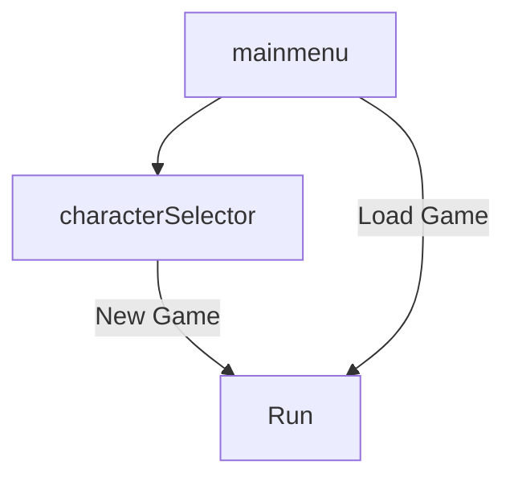
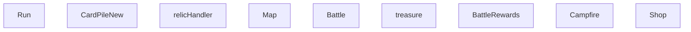

### 运行场景

### 地图生成器

地图 

地图生成器

 房间， 

路线，

摄像头（可以鼠标上下滚动）

### 遗物

遗物处理器，负责添加新遗物，移除遗物，特定条件下激活遗物

战斗后奖励，宝箱房间，可以将遗物添加到遗物处理器

战斗场景，遗物生效

商店，购买新遗物

### 战斗场景

修饰符处理器

状态处理器

两个卡牌堆视图

### battle flow

进入战斗

执行或激活回合开始遗物

玩家回合开始状态

玩家出牌回合

激活回合结束遗物

回合结束状态

丢弃手牌到弃牌堆

敌人回合开始状态

敌人执行其行动

敌人回合结束状态

所有敌人都死掉了