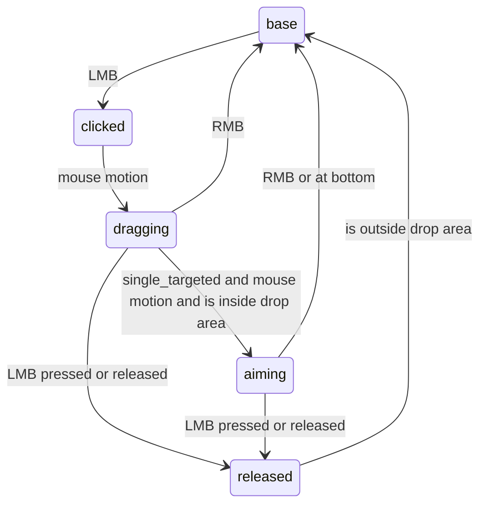

```mermaid
stateDiagram-v2
    base : base
    clicked : clicked
    dragging : dragging
    released : released
    aiming : aiming

    base --> clicked : LMB
    clicked --> dragging : mouse motion
    dragging --> released : LMB pressed or released
    released --> base : is outside drop area
    dragging --> base : RMB
    dragging --> aiming : single_targeted and mouse motion and is inside drop area
    aiming --> released : LMB pressed or released
    aiming --> base : RMB or at bottom
```

