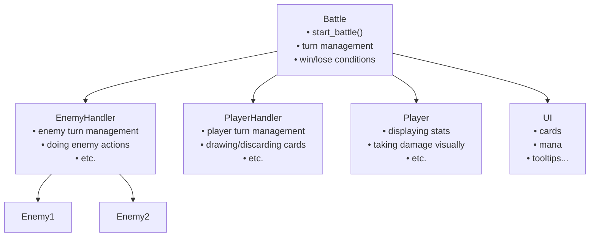

```mermaid
flowchart TD
    Battle["Battle<br>• start_battle()<br>• turn management<br>• win/lose conditions"]

    EnemyHandler["EnemyHandler<br>• enemy turn management<br>• doing enemy actions<br>• etc."]
    PlayerHandler["PlayerHandler<br>• player turn management<br>• drawing/discarding cards<br>• etc."]
    Player["Player<br>• displaying stats<br>• taking damage visually<br>• etc."]
    UI["UI<br>• cards<br>• mana<br>• tooltips..."]

    Enemy1["Enemy1"]
    Enemy2["Enemy2"]

    Battle --> EnemyHandler
    Battle --> PlayerHandler
    Battle --> Player
    Battle --> UI

    EnemyHandler --> Enemy1
    EnemyHandler --> Enemy2
```

